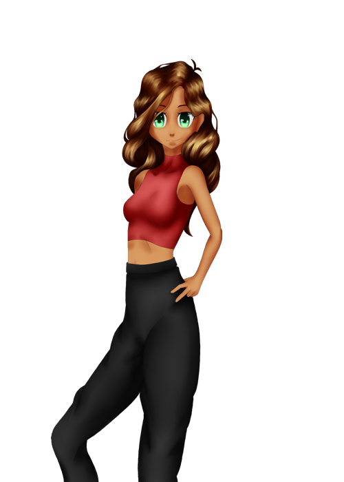
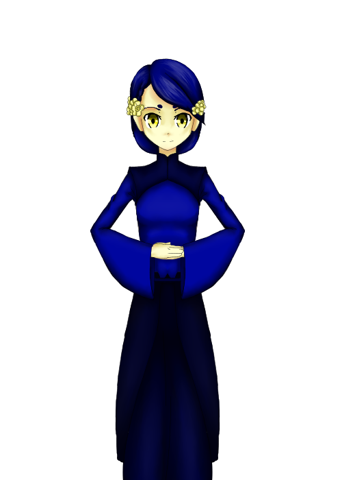
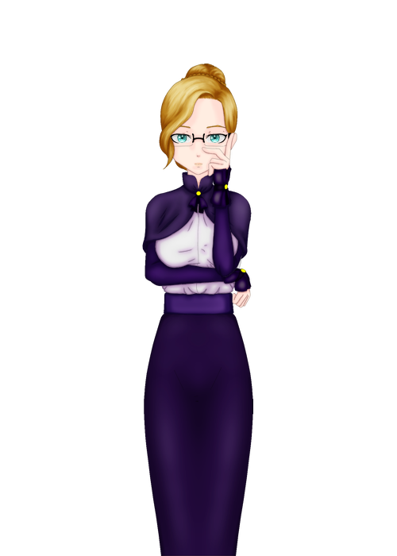

# Sumario[^sum]

1. [^faz]:__TODO__
1. [^Per]:__Personagens__
1. [^Mag]:__Magia__
1. [^Loc]:__Locais__
    1. [^Dor]:_Dormitorio_
    1. [^Aca]:_Academia_
    1. [^Flo]:_Floresta_
    1. [^Are_Aca]:_Área_Academia_
    1. [^L_Cid]:_Cidade_
1. [^M_Tem]:__Musica_tema__
1. [^Aco]:__Acontecimentos__
    1. [^ch1]:_Chapter01_
    1. [^ch2]:_Chapter02_
    1. [^ch3]:_Chapter03_
    1. [^ch4]:_Chapter04_
    1. [^ch5]:_Chapter05_
    1. [^ch6]:_Chapter06_
    1. [^ch7]:_Chapter07_
    1. [^ch8]:_Chapter08_

Jogo das sombras: Perda de Memorias

# TODO[^faz]

- [^Sum]:__Sumario__

- Devendo imagem de fora da sala
- Imagem do Lemu

# Nome das personagens[^Per]

- [^Sum]:__Sumario__

1. [^Dor_R]:__Dor. Vermelho__
    1. [^ama]:Amadi
    1. [^alo]:Alo
    1. [^yun]:Yun
1. [^Dor_G]:__Dor. Verde__
    1. [^ser]:Serafina
    1. [^nik]:Nikka
    1. [^sop]:Sophia
1. [^Dor_B]:__Dor. Azul__
    1. [^ane]:Aneti
    1. [^hin]:Hina
    1. [^oli]:Olivia
1. [^Dor_P]:__Dor. Roxo__
    1. [^mil]:Milena
    1. [^ver]:Verania
    1. [^aya]:Aya
1. [^Mem_A]:__Membros Academia__
    1. [^kae]:Kae(prof)
    1. [^cel]:Celia(prof)
    1. [^ali]:Alice(dir)
    1. [^art]:Artemisia(cantina)
1. [^cid]:__Cidade Null__

# Magias[^Mag]

- [^Sum]:__Sumario__

- Magia de Voar: Eitilt
- Magia Ofenciva: Tintreach

### Naturalidade

- Nome que se dá a habilidade especifica e inata de uma Bruxa/Maga/Feiticeira

# Locais[^Loc]

- [^Sum]:__Sumario__

- Index:
    1. [^Dor]:_Dormitorio_
    1. [^Aca]:_Academia_
    1. [^Flo]:_Floresta_
    1. [^Are_Aca]:_Área_Academia_
    1. [^L_Cid]:_Cidade_

### Dormitorio[^Dor]
- Locais
    1. [^Loc]:__Index__
    1. [^dor_vr]:__Dormitorio_Vermelho__
    1. [^dor_ve]:__Dormitorio_Verde__
    1. [^dor_az]:__Dormitorio_Azul__
    1. [^dor_ro]:__Dormitorio_Roxo_(Abandonado)__

1. Dormitorio Vermelho : __bg_d_red__[^dor_vr]

---
1. Dormitorio Verde : __bg_d_gre__ [^dor_ve]

---
1. Dormitorio Azul : __bg_d_blu__ [^dor_az]

---
1. Dormitorio Roxo (Abandonado) : __bg_d_ppl__ [^dor_ro]
 
---

### Academia[^Aca]
- Locais
    1. [^Loc]:_Index_
    1. [^ent_ac]:__Entrada_Academia__
    1. [^are_ba]:__Arena_de_Batalha__
    1. [^sal_au]:__Sala_de_aula__
    1. [^the_en]:__Enfermaria__

1. Entrada Academia : __bg_a_ent__ [^ent_ac]

1. Arena de Batalha : __bg_a_abt__ [^are_ba]

1. Sala de aula : __bg_a_aul__ [^sal_au]

1. Enfermaria : __bg_a_enf__ [^the_en]

---
### Floresta[^Flo]
- Locais
    1. [^Loc]:__Index__
    1. [^the_f]:__Floresta__
    1. [^f_ri]:__Floresta_Rio__
    1. [^f_pr]:__Floresta_Praia__
    1. [^f_ca]:__Floresta_Caverna__
    1. [^f_ca]:__Floresta_Bifurcação__
    1. [^f_es]:__Floresta_Estrada__
    1. [^f_po]:__Floresta_Ponte__ 

1. Floresta : __bg_f_flo__ [^the_f]

---
1. Floresta Rio : __bg_f_rio__ [^f_ri]

---
1. Floresta Praia : __bg_f_pra__ [^f_pr]

---
1. Floresta Caverna : __bg_f_cav__ [^f_ca]

---
1. Floresta Bifurcação : __bg_f_bif__ [^f_ca]

---
1. Floresta Estrada : __bg_f_est__ [^f_es]

---
1. Floresta Ponte : __bg_f_pnt__ [^f_po]

---
### Áreas Academia[^Are_Aca]
- Locais
    1. [^Loc]:__Index__
    1. [^int_re]:__Interior_Red__
    1. [^int_pp]:__Interior_Roxo__
    1. [^ent_vu]:__Entrada_Vulcão__
    1. [^the_vu]:__Vulção__
    1. [^aca_pr]:__Academia_Praia__
    1. [^aca_po]:__Academia_Porto__
    1. [^ent_ca]:__Entrada_Caverna__
    1. [^the_ca]:__Caverna__
    1. [^the_ma]:__Mar__
    1. [^the_ce]:__Céu__
    1. [^ceu_ni]:__Céu_Noite__

1. Interior Red : __bg_i_red__ [^int_re]

---
1. Interior Roxo : __bg_i_ppl__ [^int_pp]

---
1. Entrada Vulcão : __bg_i_evu__ [^ent_vu]

---
1. Vulção : __bg_i_vul__ [^the_vu]

---
1. Academia Praia  : __bg_i_pra__ [^aca_pr]

--- 
1. Academia Porto : __bg_i_por__ [^aca_po]

---
1. Entrada Caverna : __bg_i_eca__ [^ent_ca]

---
1. Caverna : __bg_i_cav__ [^the_ca]

---
1. Mar  : __bg_i_mar__ [^the_ma]

---
1. Céu : __bg_i_sky__ [^the_ce]

---
1. Céu Noite : __bg_i_ceu__ [^ceu_ni]

---

### Cidade[^L_Cid]
- Locais
    1. [^Loc]:__Index__
    1. [^cid_ru]:__Cidade_Rua__
    1. [^cid_ca]:__Cidade_Cafe__
    1. [^cid_po]:__Cidade_Porto__
    1. [^cid_pr]:__Cidade_Praia__
    1. [^cid_co]:__Cidade_Comercio__
    1. [^cid_mo]:__Cidade_Motel__
    1. [^cid_et]:__Cidade_Estação_de_Trem__

1. Cidade Rua[^cid_ru]

---
1. Cidade Cafe[^cid_ca]

---
1. Cidade Porto[^cid_po]

---
1. Cidade Praia[^cid_pr]

---
1. Cidade Comercio[^cid_co]

---
1. Cidade Motel[^cid_mo]

---
1. Cidade Estação de Trem[^cid_et]

---

# Personagens

- [^Sum]:__Sumario__

### Dor. Vermelho[^Dor_R]
- Amadi[^ama]
    1. Congo : Nascente Dourada
    2. Exteriotipo: Desconfiada
    3. Qualidade  : Cuida de quem considera proximo
    4. Defeito    : Acaba criando barreiras contra desconhecidos
    5. Imagem:
    
- Yun[^yun]
    1. China : Império Preto e Branco 
    2. Exteriotipo: Desatenta
    3. Qualidade  : Sencera sobre o que pensa
    4. Defeito    : esquece de obserava o ambiente
    5. Imagem:
    
- Alo[^alo]
    1. Latina : Floresta Vermelha
    2. Exteriotipo: Sempre animada
    3. Qualidade  : Não se abate pela realidade
    4. Defeito    : Autodeprecia-se
    5. Imagem:
    
---
### Dor. Verde[^Dor_G]
- Serafina[^ser] 
    1. Italia : Filoart
    2. Exteriotipo: Cuidadosa
    3. Qualidade  : Tenta ajudar todos a alcançar exelencia
    4. Defeito    : É exigente
    5. Imagem:
    
- Nikka[^nik]
    1. Russia : Imperio Gelado
    2. Exteriotipo: Coragoso
    3. Qualidade  : Alegre e gosta de historias e trotes
    4. Defeito    : Não gosta de quem não se abre
    5. Imagem:
    
- Sophia[^sop]
    1. Gracia : Vale dos Sábios
    2. Exteriotipo: Inteligente
    3. Qualidade  : Gosta de artes
    4. Defeito    : Detesta qualquer tipo de conflito
    5. Imagem:
    
---
### Dor. Azul[^Dor_B]
- Aneti[^ane]
    1. Germaina : Tribo dos Reis
    2. Exteriotipo : Estranha
    3. Qualidade   : ama animais e Criativa
    4. Defeito     : Estranha e imprevisivel
    5. Naturalidade: Falar com Animais
    6. Imagem:
    
- Hina[^hin]
    1. Japão - (Kitsune) : Ilha do Sol
    2. Exteriotipo : Elegante
    3. Qualidade   : Curiosa
    4. Defeito     : Não entende as pessoas e Timida
    5. Naturalidade: Fogo de Raposa(Regulada pela Luz da Lua)
    6. Imagem:
    
- Olivia[^oli]
    1. Estadunidence : Império da Pirâmide
    2. Exteriotipo : Individualista
    3. Qualidade   : Força de Vontade e Corajosa
    4. Defeito     : Inconsequente e Medo de parecer fraca
    5. Imagem:
    
---
### Dor. Roxo[^Dor_P]
- Milena[^mil]
    1. Slavos
    2. Exteriotipo: Dupla personalidade: Head Air/ Full foco
    3. Qualidade  : Flexivel mas sabe modera
    4. Defeito    : muda de personalidade
- Verania[^ver]
    1. Antiga Roma  (Sabe o que aconteceu)
    2. Exteriotipo: Politica
    3. Qualidade  : Quer proteger as pessoas
    4. Defeito    : Manipuladora
- Aya[^aya]
    1. Egito
    2. Exteriotipo: Narcisista
    3. Qualidade  : Trata todos bem
    4. Defeito    : Aparencia é seu preiro filtro
---
### Membros Academia[^Mem_A]
- Alice (Diretor)[^ali]
    1. Inglaterra :Cavalar
    2. Exteriotipo:Responsavel
    3. Qualidade  :Age pensando no bem das alunas
    4. Defeito    :Pouco aberta a falar
    
- Celia (Professora)[^cel]
    1. França     :Artui
    2. Exteriotipo:Persquisadora 
    3. Qualidade  :Conhece muito
    4. Defeito    :Pouco exigente
    
- Kae (Professora)[^kae]
    1. Korea
    2. Exteriotipo:Sem grandes emoçoes
    3. Qualidade  :Taletosa na magia
    4. Defeito    :Não é muito aberta
    
- Artemisia (Cantina)[^art]
    1. Espanha
    2. Exteriotipo:
    3. Qualidade  :
    4. Defeito    :
---
### Cidade[^cid]
- Allister (man)
- Rudd (man)
- Bega (wom)
- Orla (wom)
---
# Musica tema[^M_Tem]

- [^Sum]:__Sumario__

Musica       |Tensão| Sentimento               | Formalidade | Momento do Dia  | Ação                    | Personagem
:-----------:|:----:|:------------------------:|:-----------:|:---------------:|:------------------:     |:----------: 
 __cm_reu__  |   1  | Amizade, Calma, Cotidiano| Null        |Entardecer       |Concluindo, Contemplando |Null
 __ev_3__    |   2  | Relaxando, Conclusão     | Informal    |Null             |Troca Amistosa, Conclui..|Null
 __cm_ami_1__|   3  | Casualidade              | Informal    |Manhã, Tarde     |Socializando             |Null
 __ev_1__    |   4  | É o meu momento          | Null        |Null             |Null                     |Null
 __cm_ami_2__|   5  | Casualidade              | Null        |Dia, Tarde       |Tarefa, Tabalho          |Null
 __cm_ques__ |   6  | Casualidade, Observador  | Informal    |Null             |Troca amistosa           |Celia
 __cm_fem__  |   7  | Leveza                   | Null        |Null             |Socializando, Tarefa     |Null
 __ev_2__    |   8  | Liberdade, Casualidade   | Informal    |Null             |Socializando, I. leveme..|Alo, Aneti, Celia
 __e_1__     |   9  | Calma, Contemplação      | Null        |Null             |Interagindo levemente    |Null
 __e_9__     |  10  | Relaxado, Casual, Calmo  | Informal    |Dia              |Troca amistosa, dispertar|Null
 __cm_ins__  |  11  | Atenção, Observador      | Formal      |Null             |Tarefa, Estudo           |Kae
 __cm_ami_3__|  12  | Relaxado                 | Medio       |Null             |Trabalho, Tarefa         |Null
 __e_5__     |  13  | Relaxado, Cotidiano      | Informal    |Dia, Tarde       |Trabalho, Estudo, T. amis|Null
 __e_7__     |  14  | Casual.., Lev.., Cotidi..| Medio       |Null             |Socializando, I. leveme..|Null
 __ev_4__    |  15  | Conclusão, Superando     | Medio/Formal|Null             |Conclusão, Vencendo      |Null
 __e_8__     |  16  | Oculto, Atenção, Calmo   | Null        |Null             |Adentrando o desconhecido|Null
 __e_2__     |  17  | Floresta fechada, Tenção | Null        |Null             |Atenção com os arredores |Null
 __e_4__     |  18  | Foco, dedicado           | Medio       |Null             |Trabalho, Estudo         |Null
 __e_3__     |  19  | Oculto, Atenção, Risco   | Null        |Noite            |Dedicação total          |Null
 __t_2__     |  20  | Grande Confronto, risco  | Null        |Null             |Confronto com grande inim|Null
 __t_1__     |  21  | Tenção, Suspeita, Atenção| Null        |Noite            |Preparação pro que vem   |Null
 __e_6__     |  22  | Tensão, algo espreita    | Null        |Noite            |Atenção com os arredores |Null
 __t_3__     |  23  | Encurralado, grande risco| Null        |Null             |Desvantagem, Altas aposta|Null
 __t_4__     |  24  | Inimigo revelado, risco  | Null        |Null             |Encarando o perigo       |Null
 __t_5__     |  25  | Reagindo, risco, tenção  | Null        |Null             |Dando tudo de si         |Null

# Acontecimentos[^Aco]

- [^Sum]:__Sumario__

- Chegada na cidade __(Chapter01)__[^ch1]
    > Chega na cidade de trem

    > Passa pela cidade

    > Procura informação

    > Crua com Olivia

    > Encontra Anete e Alo

    > Pedem informação e assim encontram o porto

- Embarcar no Navio __(Chapter02)__[^ch2]
    > Você pode conversar com outras personagens

        Amadi
        Hina
        Nika
        Sophia
        Yun
        Seraphina

    > Aneti Alo tenta fala com Olivia, mas é ignorada

    > Chega na academia é levada até a arena de Batalha

- Teste de Classificação __(Chapter03)__[^ch3]
    > Explica sobre os Dormitorios

    > Recebe Varinhas e explica como elas funcionam

    > É ensinado a conjuração da vasolra

    > Após o teste recebe o dormitorio e o Quarto

- Dormitorio __(Chapter04)__[^ch4]

    > Uma das professora leva o grupo ater o dormitorio

    > Interage com as colegas de Dormitorio

- Primeiros dias de Aula __(Chapter05)__[^ch5]

    > Na entrada da Academia Anete conta que um passaro contou pra ela que ha mais outro dormitorio

    > Aula de voo com vassoura

    > Aula de  artes

    > Aula de meditação

    > Aula de Respiração no rio

    > Aula de Sapologia 

    > Olivia Reclama que fora o primeiro dia, não fizeram muito mais coisas com magia

    > Professora Celia propoe competição para mostrar o quam ela ja havia mudado naquela semana

    > Conversa sobre o quarto Dormitorio

    > Professora fala sobre o quarto dormitorio

- Battle Royal de Dorms __(Chapter06)__[^ch6]

    > No dia seguinte a professora escolhe alunos de cada domitorio para participar de corridas

    > Corrida 1

        Maria
        Hina
        Nikka

    > Corrida 2

        Aneti
        Serafina
        Yun

    > Corrida 3

        Olivia
        Sophia
        Alo

    > Todas estão proximas, Olivia tenta atrapalhar Sophia, mas acaba atingindo Alo

    > Sophia acaba ganhando, Alo e Olivia empatam

    > Professora da comenta

    > Pos aula

- O Principe dos Lêmures __(Chapter07)__[^ch7]

    > Duranate um aula de sapologia Aneti beija um sapo que se transasorma em um lemure

    > A professora da um tempo na Aula

    > O Lemure era o princepe dos Lemures

    > Aneti pega o Lemure como pet

- O Dormitorio Abandonado __(Chapter08)__[^ch8]

    > Tarde da noite Aneti aparece no doritorio e chama Maria pra ir

    > Está ali

        Aneti
        Hina
        Sophia
        Nikka
        Alo

    > Elas seguem rumo ao rio

    > Elas falam sobre Olivia

    > Aneti pergunta aos animais sobre o Dormitorio

    > O Grupo vai para lá e encontra o dormitorio e no dormitorio encontra tres garotas desmaiadas

    > Uma sombra negra diz que pra tirar elas dali teria que passar por cima dela e todos são rendidos

    > Hina salva todos ali librando uma luz

    > Quando acorda todos estão fora do dormitorio

    > Além de Hina, Estava professora Celia e Olivia

    > Alguns foram dali para a Enfermaria

    > A Trez que foram achadas no dormitorio e estão todas em coma

- A mulher da cantina __(Chapter09)__

    > Dois dias depois, apos a aula, o grupo vai para a cantina onde o grupo vai comer

    > Elas falam sobre o que aconteceu

    > Hina fala que foi Olivi quem falou pros professores do sumisso delas.

    > Comentam que Olivia parece proxima a mulher da cantina e Sophia diz que viu ela mais cedo ajundao ela a empurrara um caminhão

- Rebaixamento de Dormitorio __(Chapter10)__

    > Alguns dias depois é proposto pela professoara Celia um duelo entre Olivia e Nikka

    > Nikka vence sendo promovida ao Dorm Azul e Olivai rebicada

    > Olivia fiva puta

    > Dias se passaram

    > É falado que Olivia não está se dando bem no dormitorio Verde

    > É falado que a aparencia ruim dela no momento se devia a ela estava estudnado para subir noavamente

- Enfermaria __(Chapter11)__

    > Naquele dia a tarde as meninas vão até a enfermaria pra ver as 3 garotas em coma

    > Uma das garotas acorada

    > Depois  de uma conversa a garota diz que o motivo dela está naqueele estado era a professoara Celia

- O Sequestro do Vulcão __(Chapter12)__

    > Durante a noite aparecem :

        Hina
        Nikka
        Aneti
        Alo
        Sophia

    > Hina acha que Olivia está em perigo

    > Aneti pergunta pros animais onde pode estar e eles a vevam pra proxmio ao DOrm abandonado mas depois segue na direção do vulção

    > O Grupo tem a opção de seguir para a caverna ou vulção

    > o grupo encontra Olivia caida em uma ponte que dá em um poço de lava

    > Olivia está vestida com uma roupa cerimonia e meio hipnotizada  

    > Celia, a sequestradora se revela, totalmente esquisita e alterada

    > Celia conta que fez tudo aquilo pra poder isolar Olivia

    > Ela diz que faz aquilo pra poder alcaçar a verdadeira magia e criar a gema mistica verdadeira que a tornaria em uma verdadeira maga, e não precisaria de algo como uma varinha. 

    >Além disso ela poderia fazer até magias a muito esquecidas, como magias dimencionais.

    > O grupo é novamente cercado pela escuridão e é nocalteado, eles continuam conscientes por essa ser bem mais fraca

    > E agora eles veem, Hina emana uma luz e começa a lutar contra a professora.

    > Você vai lá e com toda as força do seu corpo tenta fazer Olivia despertar do tranze.

    > Grita com ela e da um soco no rosto dela o que a faz despertar.

    > Olivia ao despertar vai ajudar todo mundo, ela pega a minha varinha e desfaz circulo que estunava todos e todos se unem para lutar contra a professora
    
    > A professora por um breve momento volta a seu normal e entrega um medalhão para Olivia, enquanto estava transtornada e salta da montanha e fica em coma.

    > Hina volta pra ajudar a todos e ela e Olivia a recuperar todas  até que ela desmaia de tanto usar energia para recuperalas

    > Olivai acorada na enfermaria com todas ali e ela diz que tudo acontecu por que desde o inio tudo que ela fez era porque ela não queria parecer fraca mas esse desejo dela fez tudo acontecer daquele modo.

    > Fala do fato da professora Celia estar em coma agora

    > O Grupo a perdoa final feliz

- Torneio inter Escolar
